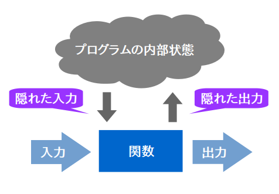
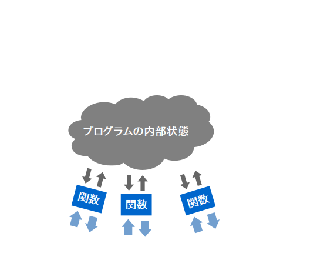
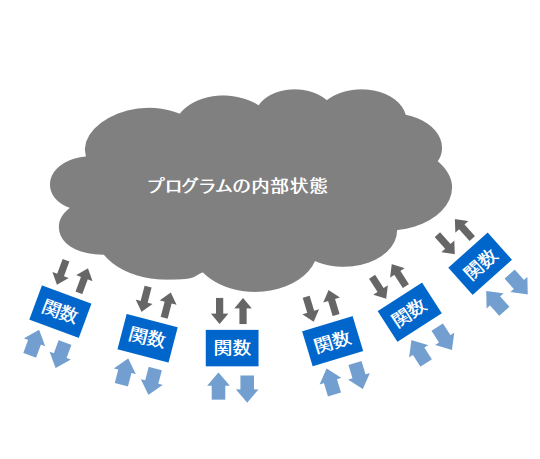
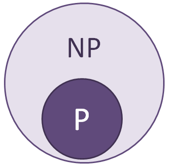

# オブジェクト指向言語に触れる

Presented by 高原 一真

----

## 目次

- はじめに
- 構造体
- モジュール
- オブジェクト
- クラスとインスタンス
- 凝集度と結合度
- 継承
- カプセル化
- ポリモーフィズム

----

## はじめに
* 目的:
  - オブジェクト指向言語を使用する動機付け。

* 対象:
  - C言語を学校の授業でやった程度。
  - 変数、関数は覚えている。
  - 構造体・ポインタは覚えていない。

---

この文章で説明する「オブジェクト指向言語」は
C++やJavaなどの古典的なクラスベースのオブジェクト指向言語です。
静的型付けには限定はしません。

筆者の知識ではオブジェクト指向とは何かを厳密に説明することはできませんので、ご了承ください。
少なくともメッセージ・パッシングには触れません。
目に余る間違いがあればご指摘よろしくお願いいたします。

----

## 構造体

---

構造体とは、

幾つかの異なる型のデータをまとめて  
1つのデータ型にしたものです。

``` c
typedef struct {   // 構造体の名前
  char name[];    // 構成要素(メンバ)の型と名前
  int age;
  double height;
  double weight;
} Person;
```

つまり、データのフォルダ分けです。

---

使うときは下のように実体を生成してから使います。
``` c
Person p;            // Person 型の実体を生成
p.name = "Tanaka";   // p の属性である name に "Tanaka" を格納
p.age = 21;          // p の属性である age に 21 を格納
p.height = 171.65;   // ...
p.weight = 65.63;    // ...
```

---

### なぜ構造体を使うのか？

---

**関連性の高いもの** を **名前を付けてまとめる** ため。

* データ同士のつながりが理解しやすくなる。
  - データの全体像が見える。

* データの管理がしやすくなる。
  - 引数・戻り値の受け渡しが楽になる。
  - 変数への格納が楽になる。

---

例: 引数がたくさんある場合

```c++
double dot(double ax, double ay, double az, double bx, double by, double bz) {
  return ax * bx  +  ay * by  +  az * bz;
}
```
```c++
void main() {
  double ax = 1, ay = 2, az = 3;
  double bx = 4, by = 5, bz = 6;

  double a_dot_b = dot(ax, ay, az, bx, by, bz);
}
```

---

構造体を使うとこうなります。

```c++
typedef struct {
  double x;
  double y;
  double z;
} Point3D;

double dot(Point3D a, Point3D b) {
  return a.x * b.x  +  a.y * b.y  +  a.z * b.z;
}
```
```c++
void main() {
  Point3D a = {1, 2, 3};
  Point3D b = {4, 5, 6};

  double a_dot_b = dot(a, b);  // すっきり！
}
```

----

## モジュール

---

一般的なソフトウェアの構成です。



---

関数は1つではないでしょう。



---

開発が進めば、プログラムは肥大化を続けます。



---

すると、ごく自然な流れとして  


それらを分割・整理したくなります。

---

こうして分割されたものが「モジュール」です。

C/C++ では1つ1つの .cファイル がこれに相当します。

---
例: ロボットアームを操作するためのモジュール
```c++
FILE* device_file;    // ロボットアームのデバイスファイル
double max_velocity;  // アームの動作速度

void connect(char device_file_name[]) {
  // 通信開始 (device_fileを更新)
}
void disconnect() {
  // 通信終了 (device_fileを更新)
}
void set_velocity(double v) {
  // 動作速度を変更 (max_velocityを更新)
}
void move_to(double x, double y, double z) {
  // 運動学でうんたらかんたら (device_file, max_velocityを使用)
}
```
```c++
void main() {
  connect("/dev/my_robot_arm");
  set_velocity(10);
  move_to(1, 2, 3);
  disconnect();
}
```

----

## オブジェクト

---

先ほどのロボットアームを扱うモジュールは、  
複数のアームを同時に操作するのは不可能です。

```c
void main() {
  connect("/dev/my_robot_arm1");  // ここで設定したデータは
  connect("/dev/my_robot_arm2");  // この時点で消えてしまう

  move_to(1, 2, 3);  // 2つ目のロボットアームが動く
}
```

接続しているアームを記憶している変数が、  
モジュールに対して1つしかないからです。

---

複数のロボットアームを扱うには？

⇓

モジュールを複製できるようにすれば良い

---

C言語的な解決策

```c++
typedef struct {  // 内部状態を保存するための構造体を作る
  FILE* device_file;
  double max_velocity;
} Arm;

// それを引数として毎回渡す
void connect(Arm* arm, char device_file_name[]);
void disconnect(Arm* arm);
void set_velocity(Arm* arm, double v);
void move_to(Arm* arm, double x, double y, double y);
```

```c++
void main() {
  Arm arm1;
  Arm arm2;
  connect(&arm1, "/dev/my_robot_arm1");
  connect(&arm2, "/dev/my_robot_arm2");
  move_to(&arm1, 300, 100, 0);
  move_to(&arm2, 100, 300, 0);
}
```

構造体の典型的な使い方です。

---

- __構造体__ は関連性の高い情報をまとめるためのもの
- __構造体__ と __構造体を扱う処理__ は強く関連している

⇓

構造体を扱う処理そのものも、  
構造体に持たせてしまえばいい

---

つまり、こんなふうに
```c++
Arm arm = Arm();
arm.connect("/dev/my_robot_arm");
arm.move_to(300, 100, 0);
arm.disconnect();
```

---

これがオブジェクトです。

「状態」と「状態を扱う処理」をまとめたものが  
オブジェクト指向における「オブジェクト」なのです。

---

なお、オブジェクトが持っている「状態を扱う処理」は
「メソッド」と呼ばれることが多いです。

----

## クラスとインスタンス

---

オブジェクトも構造体のように型があります。

「オブジェクトの型」のことを「クラス」と呼びます。

---

例: C++におけるクラスの宣言
```c++
class Arm {
public:
  FILE* device_file;
  double velocity;

  void connect(char* device_file_name) {
    // ...
  }
  void disconnect() {
    // ...
  }
  // 他の関数も同様
};
```

まさに構造体の中に関数を入れただけです。

---

クラスとはあくまでもオブジェクトの型ですから、  
そのクラスのオブジェクトを生成してから使います。

この生成されたオブジェクトのことを  
__インスタンス__ と呼びます。

クラスとインスタンスは対になる概念といえます。

---

ところで「データの型とデータ本体」というのは  
「集合とその要素」という捉え方もできます。

(例: `int` と `1`)

つまりクラスとインスタンスも、集合とその要素です。  

この捉え方が重要だと私は思っています。

----

## 凝集度と結合度

---

クラスとはモジュールの拡張版です。

⇓

良いモジュールに要求される要素は  
良いクラスにも要求されます。

---

理想的なモジュールとは？

1. 凝集度が高い
  - なんのためのモジュールかが明確。

2. 結合度が低い
  - 他のモジュールの実装に依存していない。

***

細かいことを考えなくても済む部品ということです。

----

## 継承

---

クラスを集合、インスタンスをその要素だと考えると、  
「継承」とは集合の包含関係のことです。



---

例: C++におけるクラスの継承

```c++
// 親クラス
class A {
public:
  void method_a();
};

// 子クラス
class B : public A {  // B ⊆ A  ⇔  B は A を継承する
public:
  void method_b();
};
```
```c++
void main() {
  B b = B();     // B の要素は A の要素でもあるので
  b.method_b();  // B のメソッドだけでなく
  b.method_a();  // A のメソッドも呼ぶことができる
}
```

---

### なぜ継承が必要なのか？

---

複数のクラスをひとまとめにして扱うことが  
できるようになるからです。

つまり

それぞれのクラスが共通の機能を持つことを  
保証することができるわけです。

---

例:
```c++
class A {
public:
  void method_a();
};

class B : public A {
public:
  void method_b();
};

class C : public A {
public:
  void method_c();
};

void use_A(A a);  // Aを引数とする関数
```
```c++
void main() {
  B b = B();            // B の要素は A の要素であり
  C c = C();            // C の要素も A の要素であるから、
  use_A(b); use_A(c);   // B も C も、 A を引数とする関数に渡すことができる
}
```

----

## カプセル化

---

クラス間の結合度を下げるために

__抽象的で本質的な機能だけを外部に公開しましょう__

という考え方のことです。

---

例:

```c++
class Color {
private:
  double r;  // ← 他のクラスからは見えない
  double g;  // ← 他のクラスからは見えない
  double b;  // ← 他のクラスからは見えない

public:
  double get_r();
  double get_g();
  double get_b();

  double get_h();
  double get_s();
  double get_v();
};
```

内部状態としてRGB値を持つのかHSV値を持つのかは、  
「色」というデータの本質ではないのです。

----

### ポリモーフィズム

---

人間も、犬も、車も「走る」ことができます。

同じ「走る」という名前ですが、走り方は違います。

これがポリモーフィズムです。

---

例:

```c++
class Runnable {
public:
  virtual void run() = 0;
}

class Human : public Runnable {
public:
  void run() { printf("2足歩行\n"); }
};

class Dog : public Runnable {
public:
  void run() { printf("4足歩行\n"); }
};

void run_three_times(Runnable r) { r.run(); r.run(); r.run(); }
```
```c++
void main() {
  Human human = Human();
  Dog dog = Dog();
  run_three_times(human);  // "2足歩行" と3回表示される
  run_three_times(dog);    // "4足歩行" と3回表示される
}
```

---

### 何が嬉しいのか

---

メソッドの呼び出しはオブジェクトに対する命令です。

走り方が相手によって違っても  
相手が走り方を知っているのなら  
指示する側はただ「走れ」と言うだけで済みます。

---

ポリモーフィズムの利点は

オブジェクトに対する命令を抽象化できることです。

----

---

ご清聴、ありがとうございました。
